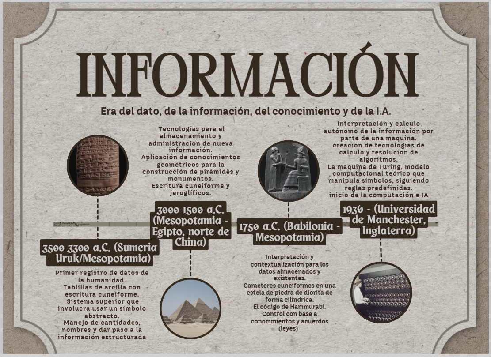

## Parte 1 - Preguntas de reflexión inicial 

### 1. ¿Qué diferencia existe entre dato e información?

#### Dato:
Representación simbólica de algo sin contexto propio **Ejemplo: "5"**

#### Información:
Conjunto de datos procesados y ordenados con una utilidad  y significado

En resumen el dato por si solo no da significado pero al ser un conjunto se le da un contexto y eso es información.

---
### 2. ¿Puede existir Inteligencia Artificial sin datos?

Respuesta :  **NO**

los datos generan clusters los cuales hacen parte del **machine learning** (aprendizaje basado en datos) usado en las redes neuronales que componen una IA

---

### 3. ¿Un Excel con fórmulas es IA? ¿Por qué?

Respuesta :  **NO**

Excel no cuenta con la capacidad de memoria, el modelo de lenguaje ni el sistema de aprendizaje necesarios para tener la precisión y la capacidad de aprendizaje que se requieren.

---
## Parte 2 - Línea del Tiempo Conceptual 

> Trabajo realizado en compañía de **Samuel Ovando Lizarazo**

---

## Parte 3 - Análisis Crítico

### 1. ¿En qué etapa se encuentra actualmente Colombia frente a la IA? 

Actualmente Colombia se une al uso habitual, recurrente y personal de la IA siendo un material importante en ámbitos de estudio, redacción u ofimática.

> Aun en Colombia no se ha estandarizado de manera significativa el uso de IA a nivel corporativo o industrial

### 2. ¿Qué riesgos implica depender excesivamente de la IA? 

Como experiencia personal, debo reconocer que el uso excesivo de la IA produce hoy en día una falta de pensamiento crítico real. Además, puede generar información o resultados pobres y cierto tipo de ‘enfriamiento’ intelectual debido al poco uso de nuestro cerebro a causa de la dependencia de estas herramientas.

### 3. ¿Qué habilidades debe desarrollar un ingeniero de software en la era de la IA?

- Prompting: Funcionamiento de los textos ingresados a las IA
- Lectura critica: Para interpretación de resultados y entendimiento de las peticiones
- Lógica Pura: desarrollo de funcionalidades
- Comunicación asertiva: Fomentar el trabajo sano en equipo 
- Coding.

